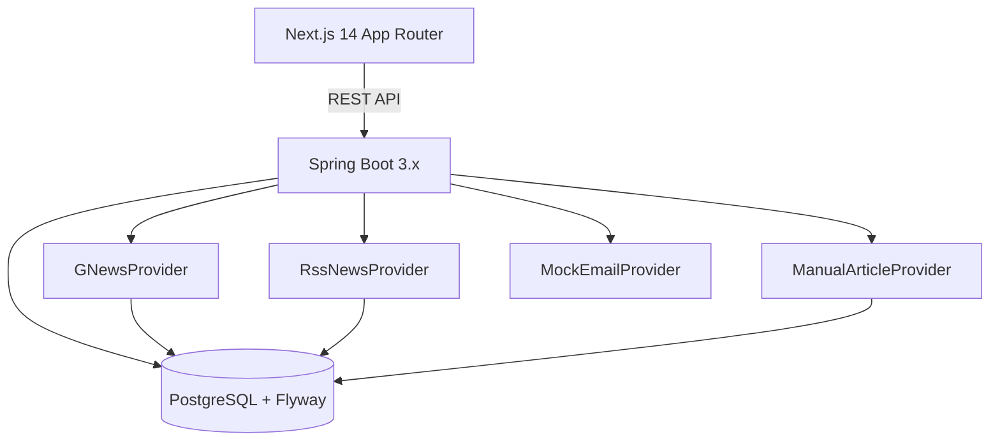

# PR News & Outreach

PR News & Outreach is a cache-first PR intelligence MVP that ingests news into Postgres, surfaces articles from the cache, and supports PR teams with trending + search coverage, personalization, and publishing workflows.

## Architecture (Phase 1)



### Cache-first rule
The UI never calls vendor APIs directly. Refreshing triggers backend ingestion into Postgres. The UI always reads from the cached tables.

### Monorepo layout
```
/backend   Spring Boot REST API
/frontend  Next.js App Router UI
```

## Database Schema (Postgres)
Managed by Flyway migrations:
- `users`
- `beats`
- `beat_query_templates`
- `user_profile`
- `user_profile_beats`
- `user_clients`
- `user_client_aliases`
- `user_keywords`
- `news_fetch_state`
- `news_cache`
- `articles`
- `saved_articles`
- `audit_log`

Seed data is installed automatically (beats, templates, sample articles, admin/member users).

## Core API Contract
- `POST /api/auth/signup`
- `POST /api/auth/login`
- `GET /api/auth/me`
- `GET /api/me/profile`
- `PUT /api/me/profile`
- `GET /api/me/clients`
- `POST /api/me/clients`
- `GET /api/beats`
- `GET /api/articles?mode=SEARCH|TRENDING&lens=ALL|CLIENT|BEAT|LOCAL|GLOBAL&beatId=&category=&from=&to=&status=&page=&size=`
- `GET /api/articles/{id}`
- `POST /api/ingest/refresh?mode=SEARCH|TRENDING&beatId=&category=&lensOrTrack=`
- `POST /api/articles/{id}/save`
- `POST /api/articles/{id}/pin`
- `GET /api/saved-articles`
- `POST /api/admin/articles/{id}/publish`
- `POST /api/admin/articles/{id}/unpublish`
- `GET /api/admin/integrations/gnews`

OpenAPI UI: `/swagger-ui`

## Local Development

### 1) Start Postgres
```bash
docker-compose up
```

### 2) Run Backend (Spring Boot)
```bash
cd backend
./gradlew bootRun
```

### 3) Run Frontend (Next.js)
```bash
cd frontend
npm install
npm run dev
```

### 4) Run Tests
```bash
cd backend
./gradlew test
```

```bash
cd frontend
npm run test
```

## Environment Variables
```bash
# Required for backend startup outside tests
INTEGRATION_MASTER_KEY=replace-with-a-strong-32-char-minimum-secret
JWT_SECRET=replace-with-a-strong-32-char-minimum-secret

# Optional local overrides
SPRING_DATASOURCE_URL=jdbc:postgresql://localhost:5432/prcontrol
SPRING_DATASOURCE_USERNAME=prcontrol
SPRING_DATASOURCE_PASSWORD=prcontrol

# Optional external integrations. Values are base64-encoded API keys.
GNEWS_API_KEY_BASE64=
GOOGLE_SEARCH_API_KEY_BASE64=
GOOGLE_SEARCH_ENGINE_ID=
GEMINI_API_KEY_BASE64=
GROQ_API_KEY_BASE64=
OPENAI_API_KEY_BASE64=
```

## Configuration
`backend/src/main/resources/application.yml` exposes rate limiting and cache controls:
```yaml
app:
  news:
    ttlMinutes: 15           # cache refresh TTL
    searchesPerMinute: 30    # max searches per user per minute
    failureThreshold: 3
    circuitMinutes: 30
```

## Product Notes
- Refresh uses GNews and serves cached data if refresh fails.
- Circuit breaker opens after repeated vendor failures.
- Manual “Add Article URL” creates records without scraping.
- Audit log entries are created for search, view, save, and publish actions.
