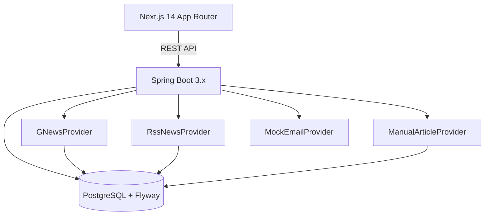

# PR News & Outreach

PR News & Outreach is a cache-first PR intelligence MVP that ingests news into Postgres, surfaces articles from the cache, and supports journalist discovery + outreach workflows.

## Architecture (Phase 1)



### Cache-first rule
The UI never calls vendor APIs directly. Refreshing triggers backend ingestion into Postgres. The UI always reads from the cached tables.

### Monorepo layout
```
/backend   Spring Boot REST API
/frontend  Next.js App Router UI
```

## Database Schema (Postgres)
Managed by Flyway migrations:
- `users`
- `beats`
- `articles`
- `article_tags`
- `news_fetch_state`
- `journalists`
- `journalist_tags`
- `outreach_templates`
- `outreach_emails`
- `audit_log`

Seed data is installed automatically (12+ beats, 100 articles, 200 journalists, 5 templates).

## Core API Contract
- `POST /api/auth/register`
- `POST /api/auth/login`
- `GET /api/beats`
- `GET /api/articles?beat=&timeframe=&page=&size=&from=`
- `POST /api/articles/refresh`
- `POST /api/articles/manual`
- `GET /api/articles/{id}`
- `POST /api/articles/{id}/save`
- `GET /api/journalists/search?beat=&outlet=&location=&keywords=`
- `GET /api/journalists/{id}`
- `GET /api/templates`
- `POST /api/outreach/send`
- `GET /api/audit`
- `GET /api/settings/integrations`

OpenAPI UI: `/swagger-ui`

## Local Development

### 1) Start Postgres
```bash
docker-compose up
```

### 2) Run Backend (Spring Boot)
```bash
cd backend
mvn spring-boot:run
```

### 3) Run Frontend (Next.js)
```bash
cd frontend
npm install
npm run dev
```

### 4) Run Tests
```bash
cd backend
mvn test
```

```bash
cd frontend
npm run test
```

## Environment Variables
```bash
GNEWS_API_KEY=your_key_here
```

## Configuration
`backend/src/main/resources/application.yml` exposes rate limiting and cache controls:
```yaml
app:
  news:
    ttlMinutes: 15           # cache refresh TTL
    searchesPerMinute: 30    # max searches per user per minute
    failureThreshold: 3
    circuitMinutes: 30
```

## Product Notes
- Refresh uses GNews, falls back to RSS, then serves cached data if both fail.
- Circuit breaker opens after repeated vendor failures.
- Manual “Add Article URL” creates records without scraping.
- Audit log entries are created for search, view, save, and send actions.
