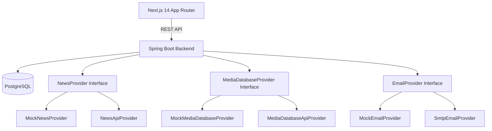

# PR Control Tower

PR Control Tower is a local-first monorepo that helps PR professionals track news, summarize coverage, discover journalists from compliant sources, and send outreach with an audit trail.

## Architecture (Phase 1)



### Folder Structure
```
/backend      Spring Boot REST API
/frontend     Next.js 14 App Router UI
/docker-compose.yml
```

### Core API Routes
- `POST /api/auth/register`
- `POST /api/auth/login`
- `POST /api/articles/search`
- `GET /api/articles/{id}`
- `POST /api/articles/{id}/save`
- `GET /api/journalists/search`
- `GET /api/journalists/{id}`
- `GET /api/templates`
- `POST /api/outreach/send`
- `POST /api/admin/seed` (ADMIN)
- `POST /api/admin/templates` (ADMIN)
- `GET /api/audit`

### Database Schema (Postgres)
Managed with Flyway migration `backend/src/main/resources/db/migration/V1__init.sql`:
- users
- workspaces
- beats
- saved_searches
- articles
- journalists
- outreach_templates
- outreach_emails
- audit_log

## Local Development

### 1) Start Postgres
```bash
docker-compose up
```

### 2) Run Backend (Spring Boot)
```bash
cd backend
mvn spring-boot:run
```

### 3) Run Frontend (Next.js)
```bash
cd frontend
npm install
npm run dev
```

### 4) Seed Data
1. Register (first user becomes ADMIN) via `/login`.
2. Call `POST /api/admin/seed` from the UI or curl to seed beats + templates.

### 5) Run Tests
```bash
cd backend
mvn test
```

## Providers & Environment Variables
Mock providers are enabled by default for a zero-key local run.

Optional real provider placeholders:
- `NEWSAPI_KEY`
- `CISION_API_KEY` or `MUCKRACK_API_KEY`
- `SMTP_HOST`, `SMTP_USER`, `SMTP_PASSWORD`

Switch providers via `application.yml`:
```
app:
  providers:
    news: real
    media: real
    email: real
```

## Compliance Notes
- No scraping; only vendor APIs or mock data.
- Outbound calls have basic rate limiting + retry wrappers.
- Email logs are stored without secrets.

## Phase Checklist
- ✅ Architecture diagram + API routes + DB schema
- ✅ Flyway migrations
- ✅ Mock providers + real skeletons
- ✅ End-to-end workflow with mock data
- ✅ Tests (unit + integration/e2e)
