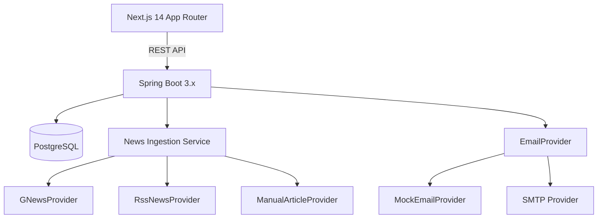

# PR News & Outreach - Architecture, Schema, API Contract

## System Architecture

## Config-Driven Inputs

- `app.beats`: list of beats to seed and expose.
- `app.news.refresh-ttl-seconds`: minimum refresh interval per beat/timeframe.
- `app.news.circuit.max-failures`: failures before circuit opens.
- `app.news.circuit.cooldown-seconds`: cooldown before retrying vendor calls.
- `app.news.gnews.base-url` + `GNEWS_API_KEY`: primary news provider.
- `app.news.rss.feeds`: map of beat -> RSS feed URLs.

## Database Schema (minimum)

- `users` (id, email, password_hash, role, workspace_id, created_at)
- `beats` (id, name, created_at)
- `articles` (id, headline, canonical_url, source, author, published_at, summary, raw_payload, fetched_at, saved)
- `article_tags` (article_id, tag_type, tag_value)
- `news_fetch_state` (id, beat_id, timeframe, last_fetch_at, last_success_at, failure_count, circuit_open_until, last_error)
- `journalists` (id, name, outlet, location, email, phone, source_provider, provider_reference_id)
- `journalist_tags` (journalist_id, tag_type, tag_value)
- `outreach_templates` (id, name, subject, body)
- `outreach_emails` (id, article_id, journalist_id, template_id, final_subject, final_body, status, sent_at, provider_message_id)
- `audit_log` (id, actor, action, entity, timestamp, metadata)

## API Contract (high-level)

### Auth
- `POST /api/auth/register` -> `{ token }`
- `POST /api/auth/login` -> `{ token }`

### Beats
- `GET /api/beats` -> `[{ id, name }]`

### Articles
- `POST /api/articles/search`
  - Request: `{ beat, timeframe, page, pageSize, filters?, customFrom?, customTo?, refresh? }`
  - Response: `{ articles: [...], stale: boolean, refreshed: boolean, lastSuccessAt }`
- `POST /api/articles/manual`
  - Request: `{ beat, headline, url, source?, author?, publishedAt?, summary? }`
  - Response: `{ article }`
- `GET /api/articles/{id}` -> `{ ...article }`
- `POST /api/articles/{id}/save?saved=true|false` -> `{ ...article }`

### Journalists
- `GET /api/journalists/search?beat=&outlet=&location=&keywords=` -> `[{ ...journalist }]`

### Templates
- `GET /api/templates` -> `[{ id, name, subject, body }]`

### Outreach
- `POST /api/outreach/send` -> `{ id, status, providerMessageId }`

### Audit
- `GET /api/audit` -> `[{ id, action, entity, timestamp, metadata }]`

### Integrations
- `GET /api/integrations` -> `{ gnews: { configured }, rss: { feeds }, email: { provider } }`

### Admin
- `POST /api/admin/seed` -> `{ status }`
